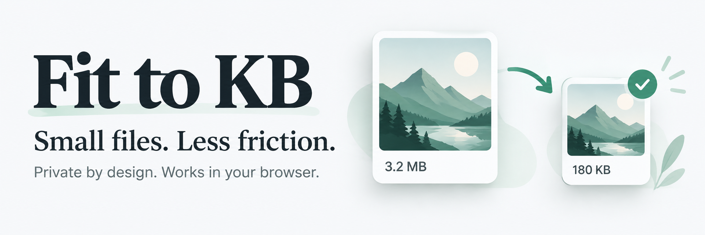

# Fit to KB

**Make your photos fit a file-size limit, right in your browser.**

[Open the app](https://talkdedsec.github.io/fit-to-kb/) · [English](#english) · [Türkçe](#türkçe)

## English

Fit to KB is a free image compression tool with **English as the default language** and a Turkish language option. No account, upload API, analytics or API key is required. Photos are processed on your device.

### Features

- Compress to a target size: 200 KB, 500 KB, 1 MB, or a custom limit.
- Process up to 20 photos together and download results individually or as a ZIP.
- Compare before/after previews, file sizes and output dimensions.
- Set optional maximum width and height while preserving aspect ratio.
- Read and export JPEG, PNG and WebP.
- Switch between English and Turkish, and light and dark themes.
- Use the responsive interface on desktop or mobile.

### How to use

1. Drop your photos onto the page or choose files.
2. Set the target KB limit, optional dimensions and output format.
3. Click **Compress photos**, review the results and download.

Use **TR** to switch to Turkish or **EN** to return to English. Explicit language choices are remembered on that device. Earlier automatically saved language defaults are replaced with English on the first visit to this version.

### Local development

Requires Node.js 22.13 or later.

```sh
npm ci
npm run dev
```

### Deploy

**GitHub Pages:** push to `main`, then select **GitHub Actions** in repository Settings → Pages. The included workflow publishes the app. `npm run build:pages` creates `pages-dist` for static hosting; relative asset paths support repository subpaths.

**Sites:** `npm run build` creates the Sites Worker build.

### Checks

```sh
npm test
npx tsc --noEmit
```

Tests cover compression decisions using a simulated encoder and static asset paths. They do not replace testing real images in a browser.

### Behavior and limits

- Up to 20 files, 30 MB per file; targets from 1 to 50,000 KB. 1 KB = 1,000 bytes.
- Output is checked against the target before download. JPEG/WebP quality is adjusted first, then resolution is reduced if needed. PNG uses resolution reduction. Impossible targets report an error.
- Aspect ratio is preserved; images are never upscaled. The working canvas is capped at 16 megapixels. Input decoding still depends on device memory.
- JPEG fills transparent pixels with white. PNG and WebP preserve transparency.
- Requires a modern browser with Canvas and `createImageBitmap`. HEIC, SVG, GIF and PDF are not supported. Animated WebP becomes a still image.
- Re-encoding removes original metadata; a smaller already compliant original may be reused with its metadata.
- Files stay in browser memory until removed or the tab closes. Changed settings require another compression run.

## Türkçe

**Fotoğraflarını tarayıcında istediğin dosya boyutuna küçült.**

[Uygulamayı aç](https://talkdedsec.github.io/fit-to-kb/)

Fit to KB, **varsayılan dili İngilizce** olan ve Türkçe seçeneği sunan ücretsiz bir fotoğraf küçültme aracıdır. Üyelik, yükleme API’si, analiz takibi veya API anahtarı gerektirmez. Fotoğraflar cihazında işlenir.

### Özellikler

- 200 KB, 500 KB, 1 MB veya özel dosya boyutu sınırına küçültme.
- Aynı anda en fazla 20 fotoğraf; tek tek veya ZIP olarak indirme.
- Önce/sonra önizlemesi, dosya boyutu ve çıktı ölçülerini karşılaştırma.
- En-boy oranını koruyarak isteğe bağlı maksimum genişlik ve yükseklik.
- JPEG, PNG ve WebP okuma ve çıktı alma.
- İngilizce/Türkçe dil seçimi ve açık/koyu tema.
- Masaüstü ve mobil ekranlara uyumlu arayüz.

### Kullanım

1. Fotoğraflarını sayfaya sürükle veya dosya seç.
2. Hedef KB sınırını, isteğe bağlı ölçüleri ve çıktı formatını belirle.
3. **Fotoğrafları küçült** düğmesine bas, sonuçları incele ve indir.

Türkçe için **TR**, İngilizce için **EN** düğmesine bas. Seçtiğin dil cihazında hatırlanır. Önceki sürümün otomatik kaydettiği dil, bu sürümde ilk açılışta İngilizce olarak yenilenir.

### Yerelde çalıştırma

Node.js 22.13 veya üzeri gerekir.

```sh
npm ci
npm run dev
```

### Yayınlama

**GitHub Pages:** kodu `main` dalına gönder; depo Settings → Pages bölümünde **GitHub Actions** seç. Hazır iş akışı uygulamayı yayınlar. `npm run build:pages` komutu statik yayın için `pages-dist` klasörünü oluşturur; göreli dosya yolları depo alt yollarını destekler.

**Sites:** `npm run build` komutu Sites Worker çıktısını oluşturur.

### Kontroller

```sh
npm test
npx tsc --noEmit
```

Testler, benzetilmiş bir kodlayıcıyla küçültme kararlarını ve statik dosya yollarını kontrol eder. Gerçek fotoğraflarla tarayıcı testinin yerini tutmaz.

### Davranış ve sınırlar

- En fazla 20 dosya, dosya başına 30 MB; hedef 1–50.000 KB. 1 KB = 1.000 bayt.
- İndirmeden önce boyut sınırı kontrol edilir. JPEG/WebP için önce kalite, gerekirse çözünürlük azaltılır. PNG için çözünürlük azaltılır. Ulaşılamayan hedeflerde hata gösterilir.
- En-boy oranı korunur; fotoğraf büyütülmez. İşleme alanı 16 megapiksel ile sınırlıdır. Girdi dosyasının açılması cihaz belleğine bağlıdır.
- JPEG şeffaf alanları beyaz yapar. PNG ve WebP şeffaflığı korur.
- Canvas ve `createImageBitmap` destekleyen güncel bir tarayıcı gerekir. HEIC, SVG, GIF ve PDF desteklenmez. Animasyonlu WebP tek kareye dönüşür.
- Yeniden kodlama özgün meta verileri kaldırır; zaten uygun ve daha küçük olan özgün dosya meta verileriyle birlikte yeniden kullanılabilir.
- Dosyalar kaldırılana veya sekme kapanana kadar tarayıcı belleğinde kalır. Ayar değişiklikleri için yeniden küçültme gerekir.
